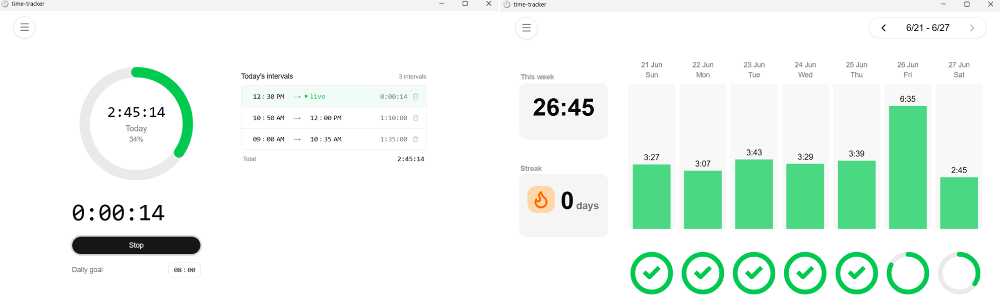
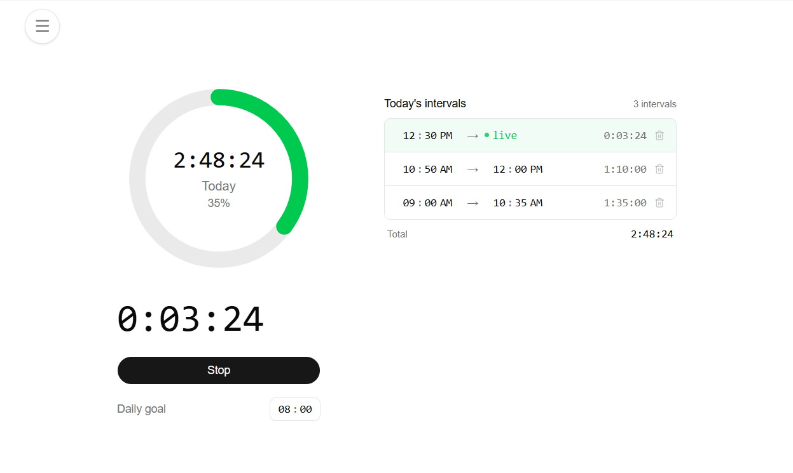
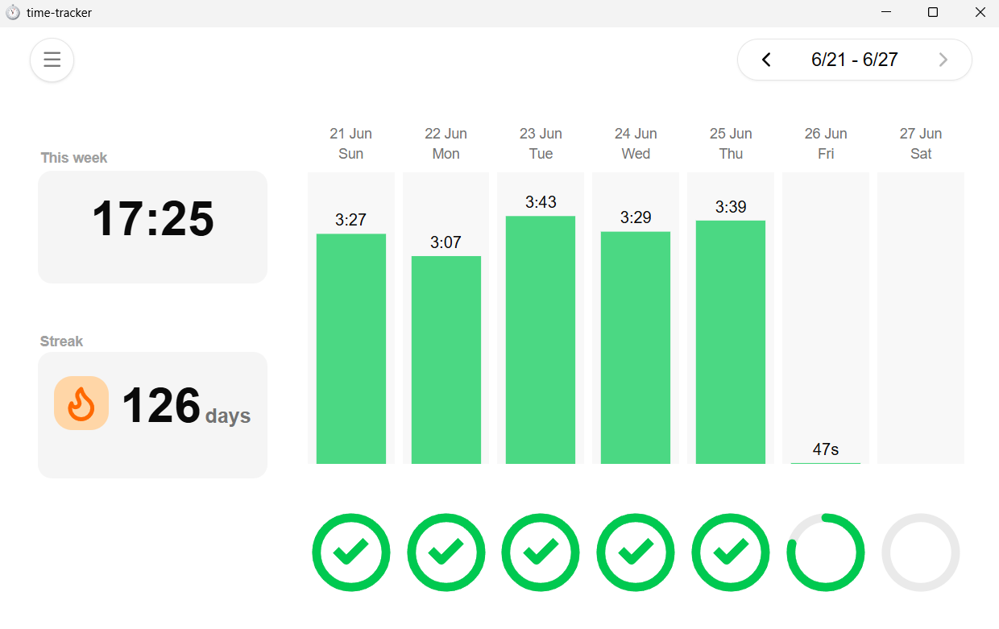
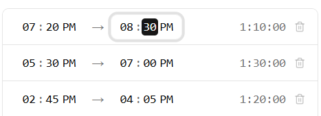
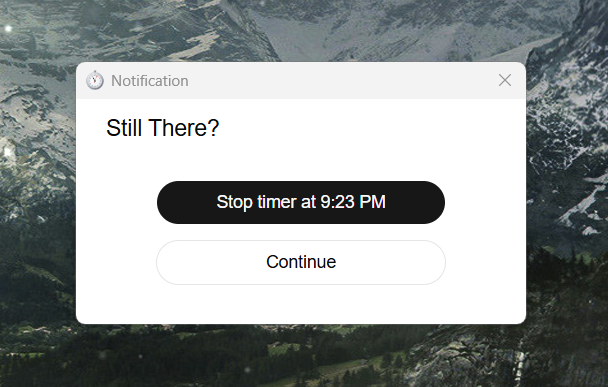
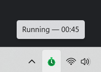

# Time Tracker

A minimal desktop time tracker for focused work days and habit building.
Motivated by the lack of non-ad filled timer/tracker alternatives.

<!-- screenshot: hero, main window, timer running -->

---

## Features

### Track Your Time

Track your time in intervals with the stopwatch on the central page. Sessions are saved automatically to a local database.

<!-- screenshot: main window with timer running -->

---

### Daily Goals & Progress

Set a daily target in hours and minutes. A circular progress ring will fill as you work showing your progress towards your goal. Today's sessions are listed with their start times, end times, and individual durations.
Past goals are tracked and persisted, so changing your current goal won't affect the record of your past accomplishments.

---

### Weekly Stats

The stats view shows data on each week and overall stats.
- A bar chart of time logged per day
- Per-day progress rings toward your goal
- A weekly total
- A streak counter that updates each time you reach your daily goal

Setting goals and seeing results is an important part of habit building. Keeping the streak "alive" can become a great source of motivation to keep going.

<!-- screenshot: stats page -->

---

### Edit & Clean Up Sessions

Didn't stop the timer on time? Started it a minute late? Click any session's time to edit it. Individual sessions can also be deleted.

<!-- screenshot: session row in edit mode -->

---

### Idle Detection

If you walk away and forget to stop the timer, its detected by the tracker. When your system goes idle, a small popup appears asking if you're still there.
You can stop the timer at the last moment of activity, or continue running. Idle detection and session editing keeps your data accurate and allows you to feel like you truly earned your streaks and stats.

<!-- screenshot: idle detection popup -->

---

### System Tray

The app follows an "always on" model and lives in the system tray. The icon reflects whether the timer is running or paused, and the tooltip shows the live elapsed time so you don't have to open the window to check. Start, stop, show, or quit from the tray menu directly. Clicking surfaces or minimizes the main window allowing editing of intervals or viewing of stats.

<!-- screenshot: tray menu open -->

---

## Platform Support

Windows and macOS.

---

## Download

> Releases coming soon.
